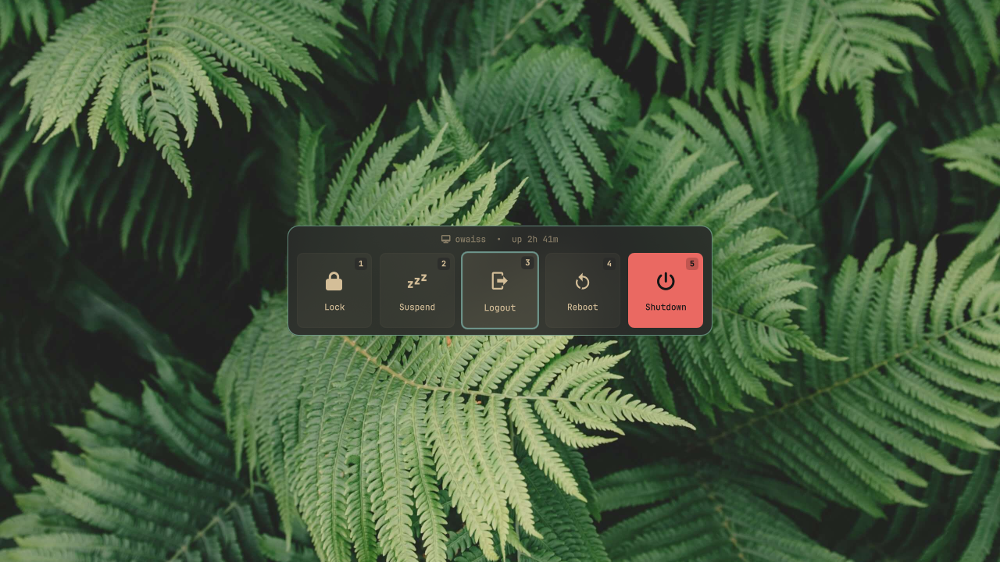
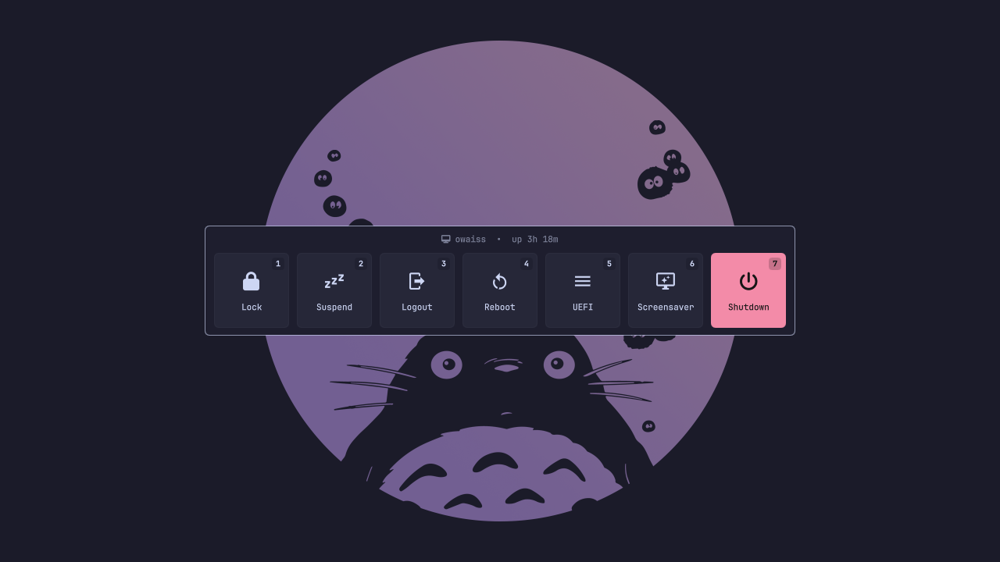
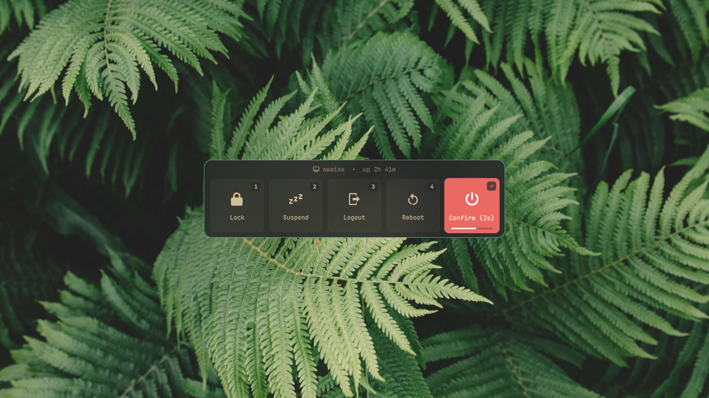
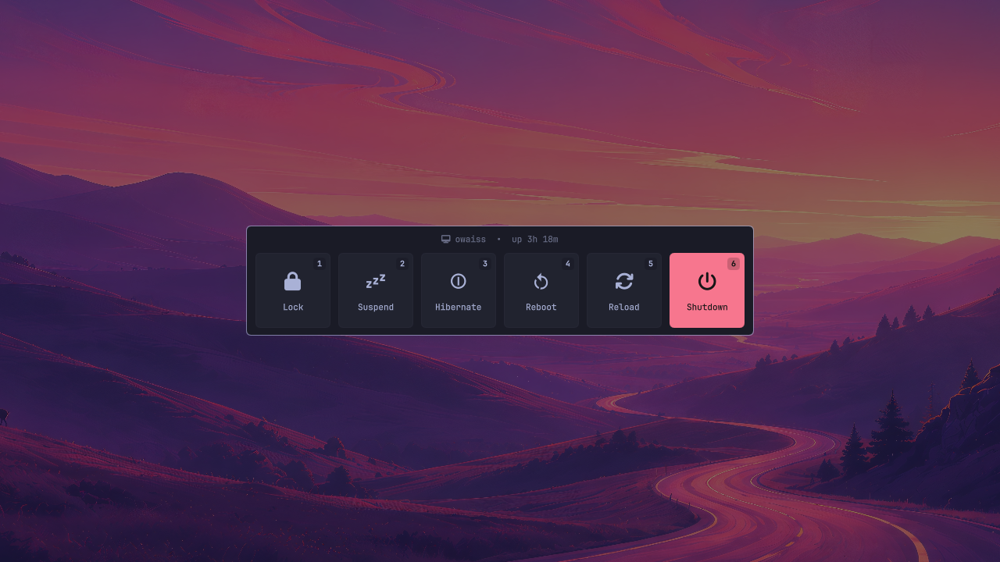
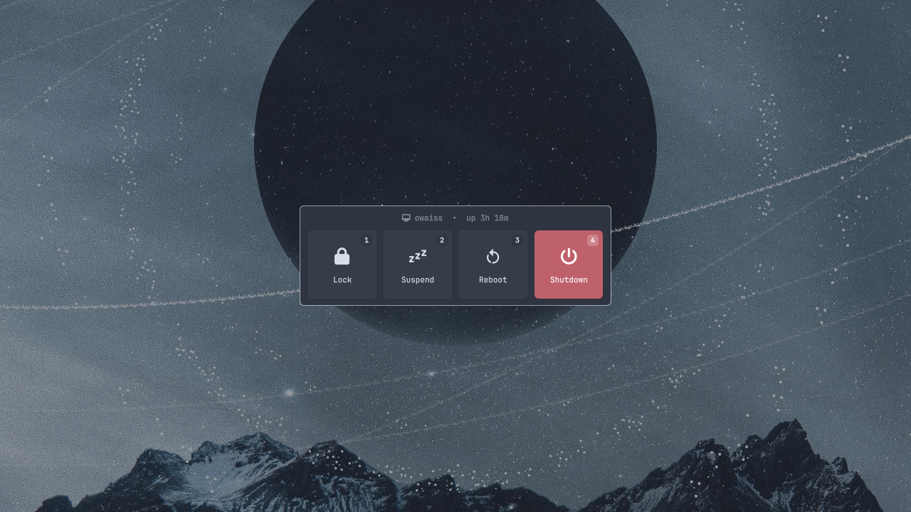

# Session Menu for Omarchy

A simple, theme-aware popout session and power menu plugin for [Omarchy](https://omarchy.org), inspired by [Noctalia Shell](https://github.com/noctalia-dev/noctalia).

<p align="center">
  
</p>

---

## ✨ Features

- **Floating Capsule Layout**: Centered floating pill dialog with theme-adaptive styling and backdrop scrim.
- **Theme-Adaptive Accents**: Automatically inherits active Omarchy theme colors (`Color.urgent` for Shutdown highlight, theme font, border radius, and surface tokens).
- **Omarchy Native Actions**:
  - `1`: **Lock** (`omarchy system lock`)
  - `2`: **Suspend** (`systemctl suspend`)
  - `3`: **Logout** (`omarchy system logout`)
  - `4`: **Reboot** (`omarchy system reboot`)
  - `5`: **Shutdown** (`omarchy system shutdown`)
- **Top Bar Launcher**: Adds an interactive power icon (``) to the status bar with native placement and drag reordering.
- **Keyboard Navigation**:
  - Direct numeric shortcuts (`1`, `2`, `3`, `4`, `5`) to trigger actions instantly.
  - `←` / `→` or `Tab` / `Shift+Tab` to navigate focus.
  - `Enter` / `Space` to execute focused or confirmed action.
  - `Esc` cancels an active confirmation or dismisses the menu.
- **Auto-Fallback Keybinding**: Cleanly opens this menu with (SUPER + ESC) when enabled, and falls back to Omarchy's default system menu when disabled.
- **Hot-Reloadable Config**: Fully customizable via `~/.config/omarchy/session-menu.jsonc`.

---

## 🎨 Themes & Custom Options

Session Menu adapts dynamically to your active Omarchy theme colors, typography, and wallpaper while supporting custom action combinations and smooth countdown confirmations.

| Extended Layout (UEFI & Screensaver) | Smooth Countdown Confirmation |
| :---: | :---: |
|  |  |
| **Maintenance Setup (Hibernate & Reload)** | **Minimal 4-Action Layout** |
|  |  |

---

## 📦 Installation

### Via Omarchy CLI (Recommended)

```bash
omarchy plugin add https://github.com/Owaisshaikh11/omarchy-session-menu.git --enable
```

### Local Development / Manual Installation

```bash
git clone https://github.com/Owaisshaikh11/omarchy-session-menu.git ~/.config/omarchy/plugins/owaiss.session-menu
omarchy-shell shell rescanPlugins
omarchy plugin enable owaiss.session-menu --section right
```

---

## ⌨️ Hyprland Keybinding

Add the following to `~/.config/hypr/bindings.lua` to bind `Super + Escape` with automatic fallback to the default system menu if the plugin is disabled:

```lua
-- Rebind SUPER + ESCAPE to Session Menu with automatic fallback
hl.unbind("SUPER + ESCAPE")
o.bind("SUPER + ESCAPE", "Session Menu", "bash -c 'grep -q \"owaiss.session-menu\" ~/.config/omarchy/shell.json 2>/dev/null && exec omarchy-shell shell toggle owaiss.session-menu || exec omarchy-menu toggle system'")
```

Reload Hyprland bindings:

```bash
hyprctl reload
```

---

## ⚙️ Customization (`session-menu.jsonc`)

The plugin works out of the box with zero configuration. To customize display preferences or configure actions, create `~/.config/omarchy/session-menu.jsonc`:

```jsonc
{
  // Display preferences
  "showPowerButton": true,       // Show or hide the top bar power launcher icon
  "showUptime": true,            // Display user and system uptime chip
  "confirmDestructive": true,    // Require second click or Enter to confirm Logout, Reboot, Shutdown
  "confirmDuration": 3,          // Countdown duration in seconds (e.g. 2, 3, 5)
  "showBadges": true,            // Show hotkey number badges (1, 2, 3...) on cards
  "highlightShutdown": true,     // Highlight the Shutdown card with theme urgent accent
  "cardSize": 96,                // Width and height of each card in logical pixels (e.g. 72-128)

  // Predefined or custom actions list
  "actions": [
    {
      "id": "lock",
      "label": "Lock",
      "icon": "",
      "command": "omarchy system lock",
      "destructive": false,
      "enabled": true
    },
    {
      "id": "suspend",
      "label": "Suspend",
      "icon": "󰒲",
      "command": "systemctl suspend",
      "destructive": false,
      "enabled": true
    },
    {
      "id": "logout",
      "label": "Logout",
      "icon": "󰍃",
      "command": "omarchy system logout",
      "destructive": true,
      "enabled": true
    },
    {
      "id": "reboot",
      "label": "Reboot",
      "icon": "󰜉",
      "command": "omarchy system reboot",
      "destructive": true,
      "enabled": true
    },
    {
      "id": "shutdown",
      "label": "Shutdown",
      "icon": "",
      "command": "omarchy system shutdown",
      "destructive": true,
      "highlight": true,
      "enabled": true
      // Optional custom color overrides:
      // "highlightColor": "#ea6962",
      // "highlightTextColor": "#161616"
    },
    // Optional additional actions (set "enabled": true to activate):
    {
      "id": "hibernate",
      "label": "Hibernate",
      "icon": "󰤁",
      "command": "systemctl hibernate",
      "destructive": true,
      "enabled": false
    },
    {
      "id": "uefi",
      "label": "UEFI",
      "icon": "󰍜",
      "command": "systemctl reboot --firmware-setup",
      "destructive": true,
      "enabled": false
    },
    {
      "id": "screensaver",
      "label": "Screensaver",
      "icon": "󱄄",
      "command": "omarchy-launch-screensaver force",
      "destructive": false,
      "enabled": false
    },
    {
      "id": "reload",
      "label": "Reload",
      "icon": "",
      "command": "hyprctl reload && omarchy restart shell",
      "destructive": false,
      "enabled": false
    }
  ]
}
```

> [!NOTE]
> Changes saved to `~/.config/omarchy/session-menu.jsonc` take effect immediately upon saving without restarting the shell.

---

## 🛠️ Bar Management

The top bar launcher icon can be moved or toggled using the standard Omarchy CLI:

- **Move widget**: `omarchy bar move owaiss.session-menu --section right`
- **Enable widget**: `omarchy plugin enable owaiss.session-menu --section right`
- **Disable widget**: `omarchy plugin disable owaiss.session-menu`

---

## 📄 License

MIT License. See [LICENSE](LICENSE).
